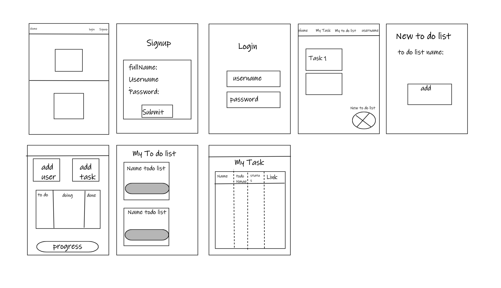
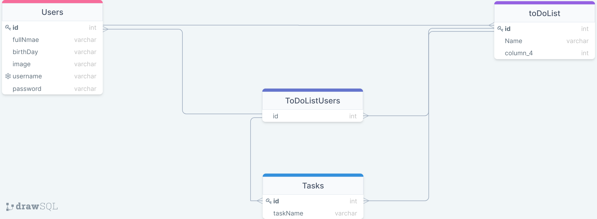

# Team Management System

## Description 

* This project (TodoList Team) is a web page through which we will organize a project by dividing it into a set of tasks, adding a group of users to it, and giving each user a specific task.  
* The user in this project can  
    Create a list and add members to it  
    Complete the tasks assigned to him
___ 

## WireFrame

___

## Schema for Database

___ 

## Members 

1. Wael Alqawasmi
2. Roaa Hailat
3. Motasem Alkilany
4. Mohammad Aladarbeh
___

## Social Communication  and Documentations 

* [Trello](https://trello.com/invite/b/iwH12lH3/ade3deb3e7a9d44370a03e5e2e1a13a8/todolistteam)

* [Team Agreement](TeamAgreement.md)

* [Requirements](Requirements.md)

* [Project Idea](projectIdeas.md)
* [app-features](app-features.md)
___

## Project slides presentations
* [Presentations](teamworkmanagment.pptx)
___

# Begin Wireframes & Software Requirements

## User Stories

1. The First Story :  
    * User Story sentence
        As an UnAuthentication user, i want the abilty just to access for home and login , signup page.

    * Feature Tasks
        1. Create new account 
        2. login from my account
        3. access to the home page
    * Acceptance Tests
        1. ensure that your username and password are correct.
        2. ensure that your account is Authentication.
2. The Secound Story : 
    * User Story Sentence
        As an Authentication user, i can to create new todo list .
    * Feature Tasks 
        1. Create todo list and name it.
        2. Add the users on this todo list.
        3. Add the task on this todo list and link it with specific users.
    * Acceptance Tests
        1. ensure that all relevant users are find.
        2. ensure the todo list was create.
        3. ensure that his information is correct .
3. The Third Story : 
    * User Story Sentence
        As an Authentication user, i can Modify on my todo list .
    * Feature Tasks 
        1. delete any users.
        2. delete any tasks.
        3. delete any todo list.
        4. edit the name for any todo list.
        5. send the requests for all users
    * Acceptance Tests
        * ensure that the user and task , todo list was deleted.
4. The Fourth Story :
    * User Story Sentence
        As an Authentication user, that his can to accept or deny the requests.
    * Feature Tasks 
        1. Accept the request for the task.
        2. Deny the request for the task.
        3. Mark the task you have completed.
    * Acceptance Tests
        1. ensure that he can see the his task when he accept the requests
        2. ensure that the completed task moved to the done category.
5. The Fifth Story : 
    * User Story Sentence
         As an Authentication user, that he can to see his tasks.
    * Feature Tasks
        1. Check the status for his task .
        2. see the due date .
        3. he can move to the todo list for his task.
    * Acceptance Tests
        * ensure that he will complete all his tasks before the due date .

# Domain Modeling

# set up the app
* after colon,  you must create DB on postgresql *todolist* called
* set username and password of postgresql properties on src->main
* start postgresql server by this command:
*  >  pg_ctl -D /home/linuxbrew/.linuxbrew/var/postgres start
* now start  spring boot app  from src->java ->TeamToDoListApplication
* now you can go to [hrer](http://localhost:8081/) to open app in local

